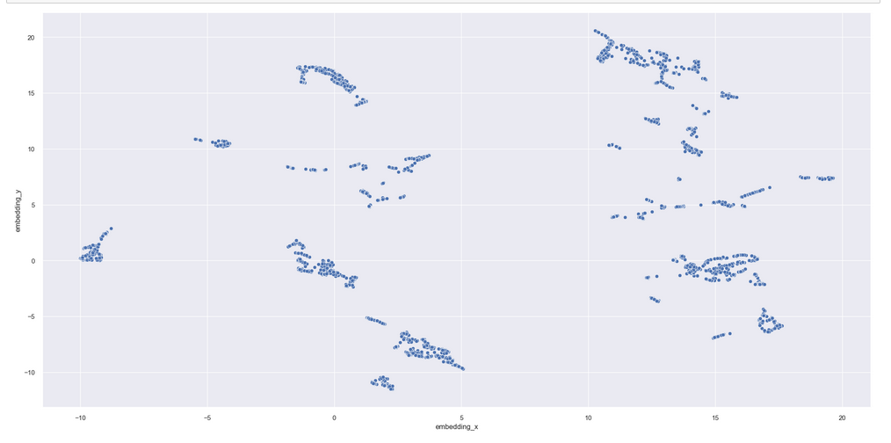
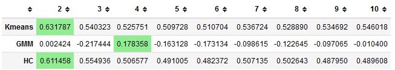
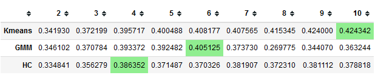
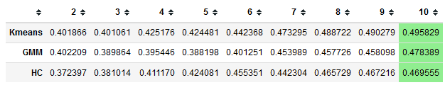

# Insiders loyalty project

## Problema de negócio

A empresa All in One Place é uma empresa Outlet Multimarcas, ou seja, ela comercializa produtos de segunda
linha de várias marcas a um preço menor, através de um e-commerce.

Em pouco mais de 1 anos de operação, o time de marketing percebeu que alguns clientes da sua base,
compram produtos mais caros, com alta frequência e acabam contribuindo com uma parcela significativa do
faturamento da empresa.

Baseado nessa percepção, o time de marketing vai lançar um programa de fidelidade para os melhores clientes
da base, chamado Insiders. Mas o time não tem um conhecimento avançado em análise de dados para eleger
os participantes do programa.

Por esse motivo, o time de marketing requisitou ao time de dados uma seleção de clientes elegíveis ao
programa, usando técnicas avançadas de manipulação de dados. Será entregue uma lista contendo os clientes classificados de acordo com suas caracteristicas de consumo, junto a lista também será entregue um dashboard para melhor visualização das caracteristicas dos grupos resultantes da análise. 

**Dataset overview**

| **Variable** | **Meaning** |
|:----------:|---------|
| Invoice Number | identificador único de cada transação |
|Stock Code Product | Código do item |
|Description Product|Nome do item|
|Quantity|A quantidade de cada item comprado por transação|
|Invoice Date|O dia em que a transação ocorreu|
|Unit Price| Preço do produto por unidade|
|Customer ID|identificador único do cliente|
|Country|O nome do país que o cliente reside|

##  Questões do negócio

Entregar uma lista de pessoas elegíveis a participar dovprograma Insiders, junto com um relatório respondendo às seguintes perguntas:

1. Quem são as pessoas elegíveis para participar do programa de Insiders ?
2. Quantos clientes farão parte do grupo?
3. Quais as principais características desses clientes ?
4. Qual a porcentagem de contribuição do faturamento, vinda do Insiders ?
5. Qual a expectativa de faturamento desse grupo para os próximos meses ?
6. Quais as condições para uma pessoa ser elegível ao Insiders ?
7. Quais as condições para uma pessoa ser removida do Insiders ?
8. Qual a garantia que o programa Insiders é melhor que o restante da base ?
9. Quais ações o time de marketing pode realizar para aumentar o faturamento?

##  Premissas do negócio
<ul>
    <li>As informações estão limitadas no periodo de Novembro de 2016 ate Dezembro de 2017.</li>
    <li>Na coluna "quantity" os valores negativos foram considerados devoluções.</li>
    <li>Foram descartados linhas que o valor unitário "unit_price" é menor que 0.04.</li>
    <li>Linhas em que o 'customer_id' tinha valores nulos foram preenchidos com valores sequenciais a partir do valor numérico mais alto da coluna. Por se tratar apenas de um identificador, esse processo não afetará o modelo ou a análise.</li>
    <li>Todas as linhas em que os valores da coluna "stock_code" não são puramente numéricos serão removidas, devido a falta de conhecimento sobre o significado desses valores.</li>
</ul>

## Planejamento da Solução

Neste projeto foi aplicado o método CRISP-DM (Cross-Industry Standard Process for Data Mining) adaptado para os processos de ciência de dados que se tornou o CRIS-DS.

Modelo crisp-dm

A divisão dos passos utilizados no projeto foi:

<ol>
<li><strong>Entendimento de negócio:</strong> Compreender o motivo da requisição dos agrupamentos de clientes e as características principais a serem observadas é fundamental para entender melhor o problema e apresentar a solução mais eficiente em menor tempo possível.
</li>

<li>
<strong>Coleta de dados:</strong> Todos os dados estavam disponíveis na plataforma, sendo esta disponibilizada pela própria empresa.
</li>
<li>
<strong>Análise descritiva:</strong> Uma breve análise dos dados para adquirir familiaridade com eles. Os dados foram divididos em numéricos e categóricos para aplicarmos os métodos de análise adequados para cada tipo. Durante a análise, observamos algumas irregularidades nos dados, que, devido à falta de informações sobre quem montou a tabela, poderiam afetar nossa análise e modelagem, como quantidades negativas e códigos alfanuméricos no código de estoque.   
</li>
<li>
<strong>Dados faltantes:</strong> No início, havía uma quantidade significativa de dados nulos na coluna 'customer_id', chegando a quase 25% dos dados. Seguindo da coluna 'description', com 0,25% de dados nulos. Por se tratar apenas de um identificador, a coluna 'customer_id' foi preenchida de forma sequencial. Já a coluna 'description' foi removida por não apresentar relevância neste momento da análise.
</li>
<li>
<strong>Filtragem de dados:</strong>Remoção de linhas que não contribuem com o modelo e aquelas que por não termos acesso aos significados dos códigos alfanuméricos podem atrapalhar a análise. Sendo eles:
<ul>
        <li>Colunas removidas: 'description','country';</li>
        <li>Linhas removidas: 
            <ul>
            <li>Linhas do 'unit_price' que tem valor abaixo de U$0.04</li> 
            <li>Linhas que a coluna 'stock_code' possui os seguntes códigos: ['POST', 'D', 'DOT', 'M', 'S', 'AMAZONFEE', 'm', 'DCGSSBOY','DCGSSGIRL', 'PADS', 'B', 'CRUK','C2']</li> 
            <li>Linhas que a coluna 'country' possuia essas descrições: ['European Community','Unspecified'].</li>
            </ul>
         </li>
</ul>
</li>
<li>
<strong>Feature engineering:</strong> Para compreender melhor o comportamento dos clientes, foram criados novos atributos a partir dos existentes. Estes atributos serão analisados para a formação de clusters. Sendo eles:

<ul>
        <li>gross_revenue;         </li>
        <li>recency_days;          </li>
        <li>qtde_invoice;          </li>
        <li>qtde_items;            </li>
        <li>qtde_products;         </li>
        <li>avg_basket_size;       </li>
        <li>avg_unique_basket_size;</li>
        <li>freq;                  </li>
        <li>avg_ticket;            </li>
        <li>avg_rec_days;          </li>
        <li>qtde_returns.          </li>
    
</ul>
    Com os novos atributos foi feita a remoção de valores nulos que surgiram com eles devido a forma como foram derivados.
</li>
<li>
<strong>Análise exploratória de dados I (EDA I):</strong> Análise dos novos atributos criados, testando e validando hyphoteses para melhor entender o comportamento deles e como se relacionam. A analise consistiu em alguma etapas. Sendo elas:
<ul>
    <li>Analise dos atributos com a biblioteca pandas-profiling onde foi possivel ver alguns outliers que poderiam atrapalhar o modelo, assim foi decidida a remoção dos mesmos</li>
    <li>Foi verificado quais atributo tinham maior variabilidade, assim melhor contribuindo para o modelo.</li> 
    <li>Foi também feito um estudo do espaço dos novos atributos levando eles para o espaço de "embedding". sendo aplicados os algoritimos: PCA, UMAP, T-SNE, Tree-based embedding</li>
    <ul>
    <li>PCA;</li> 
    <li>UMAP;</li> 
    <li>T-SNE;</li> 
    <li>Tree-based embedding.</li>
    </ul>
</ul>
    <strong>Ao final da etapa o 'Tree-based embedding' apresentou a melhor divisão de espaço. sendo o espaço gerado palo método salvo em um dataframe para ser utilizado nos próximos passos.Gráficamente o agrupamento no espaço  pode ser visto a seguir:</strong>

<li>
<strong>Preparação dos dados:</strong> Manipular os dados para se adequarem melhor num modelo de machine learning. foi aplicado a re-escala dos atributos numéricos para não força o modelo a trabalhar com valores muito altos: 
<ul>
<li>
MinMaxscaler: foi aplicado a todos os atributos já na etapa de estudo de espaço para melhor se adequar a transformação do embedding .
</li>
</ul>
</li>
    
<li>
<strong>Feature selection:</strong> Baseado nas análises dos atributos os escolhidos para dar continuidade a analise foram:
    <ul>
        <li>'customer_id'; </li>
        <li>'gross_revenue'; </li>
        <li>'recency_days'; </li>
        <li>'qtde_products'; </li>
        <li>'freq'; </li>
        <li>'qtde_return'.</li>
    </ul>
</li>

<li>
<strong>Modelos de machine learning:</strong> Nesta etapa foram aplicados quatro algoritmos de clusterização e observado quais as métricas se comportavam melhor para determinado número de clusters:
    <ul>      
    <li>K-Means</li>
    <li>GMM</li>
    <li>Hierarchical Clustering</li>
    <li>DBSCAN</li>
    <li>HDBSCAN</li>
Ao final foi escolhido o GMM.
</ul>
    <strong>Fine tuning:</strong> O fine tuning de modelos de clusterização é feito pela análise dos valores das métricas com diferentes número de clustes. As métricas utilizadas foram:
    <ul>
        <li>Within-Cluster Sum of Square (WSS)</li>
        <li>elbow</li>
        <li>Sillhouete Score</li>
    </ul>
      </li>
    <li>
        <strong>Deploy:</strong> Nesta última etapa, já tendo aplicado o modelo final no dataset e observado os valores gerados, o modelo foi colocado em produção com ferramentas AWS da seguinte forma:
        <ul>
            <li>Criado um banco de dados Postgres com o aws RDS</li>
            <li>Instânciado uma máquina  aws EC2 que atrávez da biblioteca 'papermill' e 'cronjob' irá executar o notebook para que constantemente seja refeita a análise dos clustes o observar a movimentação dos clientes entre os clusters</li>
            <li>Um dashboard no metabase foi criado acessando o banco de dados RDS</li>
        </ul>
</li>
</ol>

##  Os  principais insights de negócio

<h3><strong>Os clientes do cluster insiders possuem um volume (faturamento) de compras acima de 10% do total de compras</strong></h3>
Verdadeiro, o clusters insiders possui 54,4% do total de faturamento

<h3><strong>Os clientes do cluster insiders possuem um volume ( produtos ) de compras acima de 10% do total de compras.</strong></h3>
Verdadeiro, o clusters insiders possui 57% do total de vendas de produtos

<h3><strong>A mediana do faturamento dos clientes do cluster insider é 10% maior do que a mediana do faturamento geral.</strong></h3>
Verdadeiro, a mediana do cluster insider é 268% maior que o geral

## Performance do modelo de Machine learning 

Nesse projeto, utilizamos três algoritmos de clusterização - Kmeans, Gaussian Mixture Model (GMM) e Hierarchical Clustering (HC) - em cada espaço de features e de embeddings. Para avaliar a qualidade dos agrupamentos produzidos, utilizamos a métrica de silhueta, que mede a distância entre os pontos de dados e seus respectivos clusters em relação aos outros clusters.

Em cada caso, variamos o número de clusters e avaliamos o valor de Silhouette Score obtido para cada quantidade. Observamos que, em geral, a performance dos modelos aumentava à medida que o número de clusters aumentava, mas devido a restrições de negócios, decidimos limitar o número máximo de clusters para 10.

Os resultados obtidos foram os seguintes:

<ul>
    <h3><strong>Original Feature Space</strong></h3>
    
    <h3><strong>Umap</strong></h3>
    
    <h3><strong>T-SNE</strong></h3>
    
    <h3><strong>Tree Based Embedding</strong></h3>
    
</ul>
## Performance de cluster

## Resultados 

##  Conclusão

##  Próximos passos
<ul>
<li>Testar mais hipóteses;</li>
<li>Novo ciclo do CRISP-DM;</li>
<li>Testar outros algoritmos de clusterização;</li>
<li>Criar novas features.</li>
</ul>

## Ferramentas utilizadas

<ul>
    <li>Jupyter notebook</li>
    <li>Git</li>
    <li>Python</li>
    <li>Pandas</li>
    <li>Numpy</li>
    <li>Sklearn</li>
    <li>Seaborn</li>
    <li>Umap</li>
    <li>PCA</li>
    <li>T-SNE</li>
    <li>aws</li>
</ul>